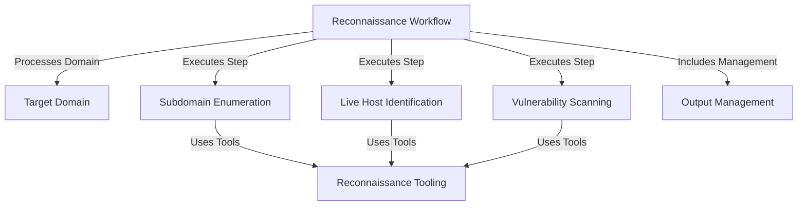
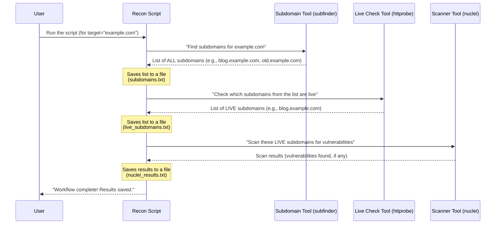
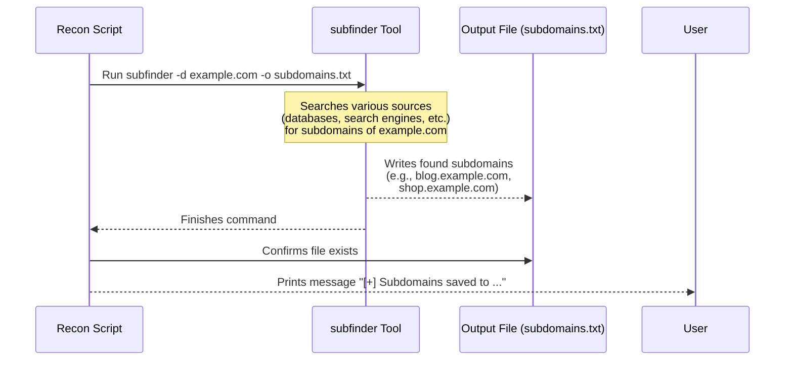
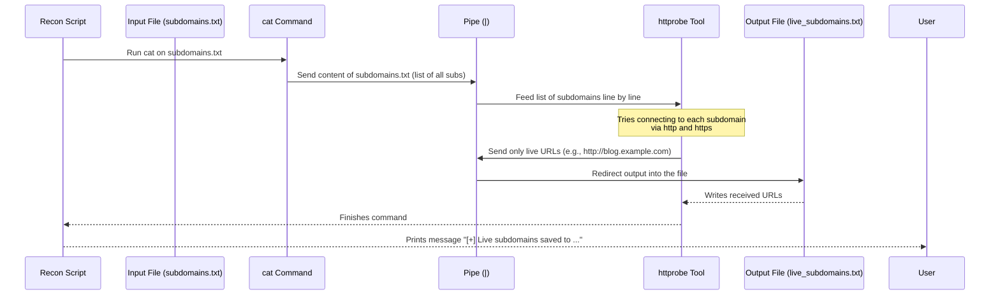
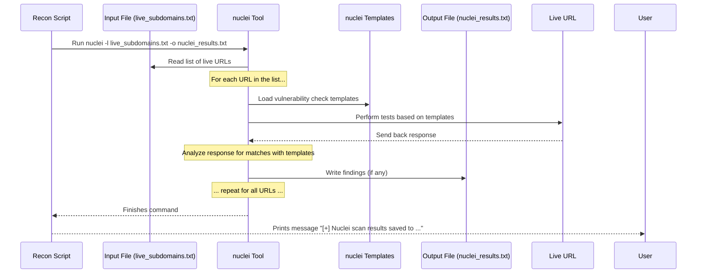
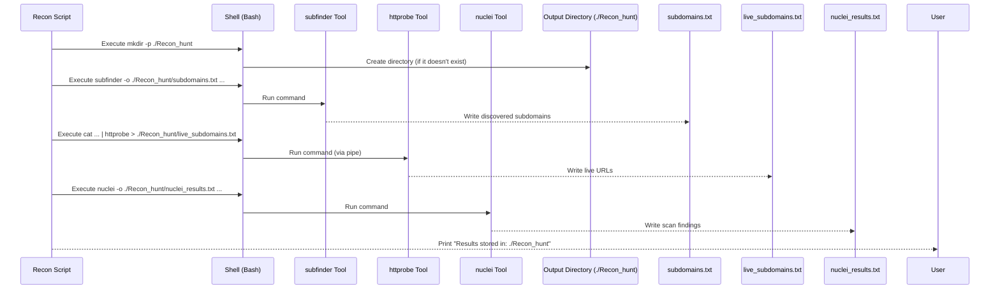

# Tutorial: Recon_Automation

This script automates the initial steps of *bug hunting* by performing *reconnaissance* on a **target domain**.
It automatically finds related *subdomains*, identifies which ones are **live** and accessible, and then
runs **vulnerability scans** on those live sites, saving all the findings neatly into **output files**.


## Visual Overview



## Chapters

1. [Target Domain
](01_target_domain_.md)
2. [Reconnaissance Workflow
](02_reconnaissance_workflow_.md)
3. [Subdomain Enumeration
](03_subdomain_enumeration_.md)
4. [Live Host Identification
](04_live_host_identification_.md)
5. [Vulnerability Scanning
](05_vulnerability_scanning_.md)
6. [Output Management
](06_output_management_.md)
7. [Reconnaissance Tooling
](07_reconnaissance_tooling_.md)

---

# Chapter 1: Target Domain

Welcome to the `Recon_Automation` tutorial! In this first chapter, we'll start with the most fundamental concept: the **Target Domain**. Think of this as the very first piece of information you need before you can start any investigation.

Imagine you're a detective assigned to a case. The very first thing you need to know is: **Who or what are you investigating?** Are you looking into "Company X" or perhaps the website "example.com"? You can't start gathering clues (like finding their headquarters or checking their online activity) until you know *who* your target is.

In our `Recon_Automation` script, the "Target Domain" is exactly that – it's the specific website or application you want to investigate for potential security issues. It's the primary subject of our reconnaissance process.

### What is a Target Domain?

Simply put, the Target Domain is the main address on the internet that your investigation will focus on. It's like `google.com`, `github.com`, or any other website you might visit. When we run our automation script, we need to tell it which domain to focus on.

### Why is it Important?

All the subsequent steps in reconnaissance – like finding subdomains ([Subdomain Enumeration](03_subdomain_enumeration_.md)), checking if parts of the site are live ([Live Host Identification](04_live_host_identification_.md)), and scanning for vulnerabilities ([Vulnerability Scanning](05_vulnerability_scanning_.md)) – are all centered around this specific domain. If you tell the script to investigate "example.com", it won't go off and start looking at "anotherwebsite.org" by accident.

### How the Script Uses the Target Domain

Let's look at a tiny piece of the `recon.sh` script to see where the Target Domain is defined.

```bash
#!/bin/bash

# Target domain
TARGET="example.com"

# ... rest of the script ...
```

In this snippet from the `recon.sh` file, the line `TARGET="example.com"` is where we tell the script our target.

*   `TARGET` is a variable (a named box to store information) that we've created.
*   `="example.com"` means we are putting the value `"example.com"` inside the `TARGET` variable.

So, in this specific example, the script's target domain is set to `example.com`.

**To investigate a *different* domain**, all you would need to do is change this line to the domain you are interested in, for example:

```bash
TARGET="yourtarget.com"
```

This simple line tells the entire script what to focus on. Every tool and step the script runs will use the value stored in the `TARGET` variable to know which domain to investigate.

### Under the Hood (Simple View)

When you run the `recon.sh` script:

1.  The script starts.
2.  It reads the line `TARGET="example.com"` (or whatever you set it to).
3.  It remembers this value.
4.  Whenever it needs to perform a step like finding subdomains, it uses the stored `TARGET` value. For example, it will tell the subdomain finding tool: "Find subdomains for *this* target: `example.com`".

It's that straightforward! The `TARGET` variable acts like a command to the script, saying "Your mission, should you choose to accept it, is to investigate *this* domain."

### Conclusion

The Target Domain is the crucial starting point for our reconnaissance automation. By setting the `TARGET` variable in the script, we specify the single website or application that all subsequent security checks will focus on. It's the 'who' of our detective work.

Now that we understand how to tell the script *what* to investigate, let's move on to how the script organizes the entire investigation process.

[Next Chapter: Reconnaissance Workflow](02_reconnaissance_workflow_.md)

---

# Chapter 2: Reconnaissance Workflow

Welcome back! In the previous chapter, [Chapter 1: Target Domain](01_target_domain_.md), we learned about the crucial first step: telling our `Recon_Automation` script *what* website or application to investigate by setting the Target Domain.

Now that the script knows its mission and its target, how does it actually *do* the investigation? This is where the concept of a **Reconnaissance Workflow** comes in.

### What is a Reconnaissance Workflow?

Imagine you're making a cake. You don't just throw all the ingredients into a bowl at once. You follow a specific set of instructions in a particular order: first mix the dry ingredients, then add the wet ones, then bake, and finally decorate. This step-by-step process is the recipe – it's the *workflow* for making a cake.

In the same way, the `Recon_Automation` script follows a "recipe" or a sequence of steps to perform reconnaissance. This ordered sequence is the **Reconnaissance Workflow**. It's the plan the script executes from start to finish to gather information about your target domain.

It defines:
1.  **What** tasks to perform (like finding subdomains, checking if they're active, scanning for issues).
2.  **In what order** to perform these tasks.
3.  **How the output of one step becomes the input for the next step.**

Think of it like an assembly line in a factory. Each station on the assembly line does a specific task, and the product moves from one station to the next until it's complete. Our workflow does the same thing with information about the target domain.

### Why is a Workflow Important?

Doing reconnaissance effectively isn't just about using a bunch of tools; it's about using them in a smart order.

*   You need to find subdomains *before* you can check if they are live. (You can't check if something exists if you don't know its address!).
*   You need a list of live subdomains *before* you can scan them for vulnerabilities. (Why scan something that isn't even online?).

The workflow ensures that the script performs these steps logically and efficiently, building upon the results of the previous stage.

### The Script's Workflow: A High-Level View

Our `Recon_Automation` script follows a simple, common workflow for basic web reconnaissance. Here are the main steps it performs in order:

1.  **Subdomain Enumeration:** Find all related subdomains for the Target Domain (like `blog.example.com`, `shop.example.com`, etc.). This gives us a list of potential places to investigate. (We'll cover this in detail in [Chapter 3: Subdomain Enumeration](03_subdomain_enumeration_.md)).
2.  **Live Host Identification:** Check which of the found subdomains are actually active and responding on the internet. This filters out old or non-existent addresses. (More on this in [Chapter 4: Live Host Identification](04_live_host_identification_.md)).
3.  **Vulnerability Scanning:** Take the list of *live* subdomains and scan them for known security weaknesses or common issues. (Detailed in [Chapter 5: Vulnerability Scanning](05_vulnerability_scanning_.md)).
4.  **Output Management:** Save all the findings from the previous steps into organized files so you can review them later. (Explained in [Chapter 6: Output Management](06_output_management_.md)).

### How the Script Executes the Workflow

You don't need to manually tell the script to perform each step. When you run the `recon.sh` script, it follows the predefined workflow automatically.

Let's look at the core part of the `recon.sh` script that shows this sequence:

```bash
#!/bin/bash

# ... (variables and setup from Chapter 1) ...

echo "[*] Starting Bug Hunting for $TARGET"

# Step 1: Subdomain Enumeration
echo "[*] Running subfinder to enumerate subdomains..."
subfinder -d $TARGET -o $SUBS_FILE
echo "[+] Subdomains saved to $SUBS_FILE"

# Step 2: Check live subdomains
echo "[*] Checking live subdomains with httprobe..."
cat $SUBS_FILE | httprobe > $LIVE_SUBS_FILE
echo "[+] Live subdomains saved to $LIVE_SUBS_FILE"

# Step 3: Vulnerability scanning
echo "[*] Running nuclei vulnerability scan on live subdomains..."
nuclei -l $LIVE_SUBS_FILE -o $NUCLEI_OUTPUT
echo "[+] Nuclei scan results saved to $NUCLEI_OUTPUT"

echo "[*] Bug hunting automation complete!"
echo "Results stored in: $OUTPUT_DIR"
```

Look at the comments like `# Step 1`, `# Step 2`, `# Step 3`. These comments clearly mark the different stages of the workflow within the script. The commands below each comment (`subfinder`, `httprobe`, `nuclei`) are executed one after another.

Notice how the output file from Step 1 (`$SUBS_FILE`, containing all subdomains) is used as the *input* for Step 2 (`cat $SUBS_FILE`). The output file from Step 2 (`$LIVE_SUBS_FILE`, containing only live subdomains) is then used as the *input* for Step 3 (`nuclei -l $LIVE_SUBS_FILE`). This chaining of steps is the essence of the workflow.

### Under the Hood: The Workflow in Action

Let's visualize the process when you run the script for a target, say `example.com`:



This diagram shows how the `Recon Script` acts as the conductor, orchestrating the different tools (`subfinder`, `httprobe`, `nuclei`) in the defined sequence, passing the results from one tool to the next.

### Conclusion

The Reconnaissance Workflow is the backbone of our `Recon_Automation` script. It's the predefined series of actions (finding subdomains, checking if they're live, scanning) that the script performs in a specific order after you provide the target. Understanding this workflow helps you see the overall process and how the different parts of the script fit together.

Now that we have the big picture of the workflow, let's dive into the very first step: finding all those potential subdomains!

[Next Chapter: Subdomain Enumeration](03_subdomain_enumeration_.md)

---

# Chapter 3: Subdomain Enumeration

Welcome back, future security detective!

In the last chapter, [Chapter 2: Reconnaissance Workflow](02_reconnaissance_workflow_.md), we looked at the overall plan – the "recipe" – our `Recon_Automation` script follows to investigate a target domain. We saw that the very first major step in this workflow is finding subdomains.

Now, let's zoom in and understand this crucial first step: **Subdomain Enumeration**.

### What is Subdomain Enumeration?

Imagine your target domain, say `example.com`, is like the main headquarters of a company. But large companies often have many different offices, departments, or branches, right? They might have a separate building for their sales team, another for their support staff, a warehouse, etc.

On the internet, these "branches" of a main domain are often represented by **subdomains**.

A subdomain is simply another name that is part of the main domain. It comes *before* the main domain name and is separated by a dot (`.`).

For `example.com`, some subdomains could be:

*   `blog.example.com` (maybe where they publish articles)
*   `shop.example.com` (their online store)
*   `support.example.com` (their help desk portal)
*   `dev.example.com` (maybe a testing version of their website)
*   `mail.example.com` (their email server)
*   ...and many, many more!

**Subdomain Enumeration** is the process of discovering as many of these associated subdomains as possible for a given target domain.

### Why is Finding Subdomains Important?

When doing security reconnaissance (gathering information for security testing), you want to find all the doors, windows, and back alleys of the target's online presence. The main website (`example.com`) is just the front door. Subdomains are often those side doors or less obvious entrances.

*   They might run different software than the main site.
*   They could be older systems that haven't been updated.
*   They might be less monitored or protected.
*   Sometimes, a vulnerability exists on a lesser-known subdomain that could affect the entire domain.

By finding subdomains, you **expand your potential attack surface** – you find more places to look for security weaknesses. You can't test something if you don't know it exists!

### How the Script Finds Subdomains

Our `Recon_Automation` script automates this discovery process using a specialized tool called `subfinder`.

`subfinder` is designed specifically for this task. It uses various techniques and sources to find subdomains, like:

*   Checking public databases that list domain names.
*   Using search engines to look for mentions of subdomains.
*   Looking at DNS records (like phone book entries for the internet).
*   And more complex methods we won't go into detail about here!

The important thing is that `subfinder` does the heavy lifting of searching for us.

### The Subdomain Enumeration Step in the Script

Let's look at the part of the `recon.sh` script that handles this step.

```bash
# ... (previous setup code) ...

echo "[*] Starting Bug Hunting for $TARGET"

# Step 1: Subdomain Enumeration with subfinder
echo "[*] Running subfinder to enumerate subdomains..."
subfinder -d $TARGET -o $SUBS_FILE
echo "[+] Subdomains saved to $SUBS_FILE"

# ... (rest of the script) ...
```

This small section is where the magic happens for subdomain enumeration.

1.  `echo "[*] Running subfinder to enumerate subdomains..."`: This line just prints a message to your screen so you know what the script is doing.
2.  `subfinder -d $TARGET -o $SUBS_FILE`: This is the core command.
    *   `subfinder`: This calls the `subfinder` tool.
    *   `-d $TARGET`: This option tells `subfinder` the target domain (`$TARGET`) we set in [Chapter 1: Target Domain](01_target_domain_.md). `subfinder` will look for subdomains *of* this specific domain.
    *   `-o $SUBS_FILE`: This option tells `subfinder` to save the results (the list of found subdomains) into a file. The filename is stored in the `$SUBS_FILE` variable, which we saw in [Chapter 2: Reconnaissance Workflow](02_reconnaissance_workflow_.md) is set to `./Recon_hunt/subdomains.txt`.
3.  `echo "[+] Subdomains saved to $SUBS_FILE"`: Another message confirming that the step is complete and where the results were saved.

So, this single command tells `subfinder` to find subdomains for your target and put them in a specific file.

### Input and Output

*   **Input:** The `$TARGET` variable containing the main domain name (e.g., `example.com`).
*   **Output:** A file named `subdomains.txt` (or whatever `$SUBS_FILE` is set to) in the output directory. This file will contain a list, with each line being a discovered subdomain.

Example `subdomains.txt` content (if `TARGET="example.com"`):

```
example.com
www.example.com
blog.example.com
shop.example.com
mail.example.com
old.example.com
staging.example.com
```

*(Note: The main domain itself is often included in the list)*

### Under the Hood: The Subdomain Step

Let's visualize what happens when the script hits this part:



The script basically delegates the task to the `subfinder` tool, waits for it to finish writing the list to the file, and then moves on.

### What's Next?

The file `$SUBS_FILE` (`./Recon_hunt/subdomains.txt`) now contains a list of all the subdomains `subfinder` could find. However, this list might contain subdomains that no longer exist or aren't currently active websites (maybe they were used for a temporary project and are now offline).

In the next step of our workflow, we need to check which of these found subdomains are actually live and accessible on the internet. This is crucial because we can only scan systems for vulnerabilities if they are online and responding.

### Conclusion

Subdomain Enumeration is the vital first step in our reconnaissance workflow. By using a tool like `subfinder`, our script automatically discovers many potential entry points (subdomains) related to our target domain. The output of this step – the list of all found subdomains – becomes the input for the next stage, where we filter this list to find only the ones that are currently active.

[Next Chapter: Live Host Identification](04_live_host_identification_.md)

---
# Chapter 4: Live Host Identification

Welcome back! In the previous chapter, [Chapter 3: Subdomain Enumeration](03_subdomain_enumeration_.md), we learned how our `Recon_Automation` script uses `subfinder` to discover a whole list of subdomains associated with our target domain. This list is great – it gives us many potential places to look!

However, not every subdomain that `subfinder` finds might be currently active or reachable on the internet. Some might be old, taken down, or never even existed as public websites.

Imagine you found an old phone book with hundreds of numbers for a company's employees. Before you start calling them all to ask questions, you'd probably want to check which numbers are still active lines, right? You wouldn't want to waste time calling disconnected numbers.

This is exactly what **Live Host Identification** does for our list of subdomains.

### What is Live Host Identification?

After finding a list of subdomains ([Chapter 3](03_subdomain_enumeration_.md)), the process of **Live Host Identification** is simply checking which of those subdomains are actually **active and reachable online**, specifically over HTTP or HTTPS (the protocols used by web browsers).

It filters out the inactive or non-existent ones, leaving us with a clean list of only the operational web servers or applications connected to the target domain.

### Why is Identifying Live Hosts Important?

Continuing with our detective analogy: Subdomain enumeration gives us a list of potential buildings or branches associated with the target company. Live Host Identification is like sending someone to quickly check which of those buildings actually have lights on and are open for business.

We focus on live hosts because:

*   **Efficiency:** There's no point trying to scan or test a subdomain that isn't online. Filtering saves time and resources.
*   **Accuracy:** Subsequent steps, like vulnerability scanning ([Chapter 5](05_vulnerability_scanning_.md)), need active web servers to connect to and test.

This step ensures that our reconnaissance workflow continues only with targets that we can actually interact with.

### How the Script Checks for Live Hosts

Our `Recon_Automation` script uses a simple yet effective tool called `httprobe` for this task.

`httprobe` is designed to take a list of domains (like the one generated by `subfinder`) and check if they are accessible via HTTP or HTTPS. If a domain responds, `httprobe` prints its URL (like `http://subdomain.example.com` or `https://othersub.example.com`). If it doesn't respond, `httprobe` simply ignores it.

### The Live Host Identification Step in the Script

Let's look at the part of the `recon.sh` script that performs this check.

```bash
# ... (previous steps: setup, subdomain enumeration) ...

# Step 2: Check live subdomains with httprobe
echo "[*] Checking live subdomains with httprobe..."
cat $SUBS_FILE | httprobe > $LIVE_SUBS_FILE
echo "[+] Live subdomains saved to $LIVE_SUBS_FILE"

# ... (rest of the script) ...
```

This section, marked as `# Step 2`, is where we identify the live hosts.

1.  `echo "[*] Checking live subdomains with httprobe..."`: Prints a message to show this step is starting.
2.  `cat $SUBS_FILE | httprobe > $LIVE_SUBS_FILE`: This is the core command, which looks a bit more complex than the last one, but we can break it down:
    *   `cat $SUBS_FILE`: The `cat` command is typically used to display the contents of a file. Here, it's used to *read* the list of subdomains from the file stored in the `$SUBS_FILE` variable (the `subdomains.txt` file from [Chapter 3](03_subdomain_enumeration_.md)).
    *   `|`: This is called a "pipe". It takes the output of the command on its left (`cat $SUBS_FILE`, which is the list of subdomains) and feeds it as the *input* to the command on its right (`httprobe`). Think of it like a pipe carrying water from one place to another.
    *   `httprobe`: This calls the `httprobe` tool. Because of the pipe (`|`), `httprobe` receives the list of subdomains one by one from `cat`. It then tries to connect to each subdomain via HTTP and HTTPS. If it successfully connects, it prints the full URL (e.g., `http://blog.example.com`).
    *   `>`: This is a redirection operator. It takes the output of the command on its left (`httprobe`, which is the list of *only* the live URLs) and *writes* it into the file specified on its right (`$LIVE_SUBS_FILE`, which is set to `./Recon_hunt/live_subdomains.txt`). It overwrites the file if it already exists.
3.  `echo "[+] Live subdomains saved to $LIVE_SUBS_FILE"`: Confirms the step is done and where the results are stored.

So, in summary: Read the list of *all* subdomains from the first file, send that list through a "pipe" to `httprobe`, `httprobe` checks which ones are live, and then the list of *only* the live ones is saved into a *new* file.

### Input and Output

*   **Input:** The `$SUBS_FILE` (`subdomains.txt`) which contains the list of all discovered subdomains from [Chapter 3](03_subdomain_enumeration_.md).
*   **Output:** A new file named `live_subdomains.txt` (or whatever `$LIVE_SUBS_FILE` is set to) in the output directory. This file will contain a filtered list, with each line being a full URL (including `http://` or `https://`) for a subdomain that was found to be live.

Example `$SUBS_FILE` content (input):

```
example.com
www.example.com
blog.example.com
shop.example.com
mail.example.com
old.example.com
staging.example.com
```

Example `$LIVE_SUBS_FILE` content (output, assuming `mail` and `old` were not live websites):

```
http://example.com
https://example.com
http://www.example.com
https://www.example.com
https://blog.example.com
https://shop.example.com
http://staging.example.com
```
*(Note: `httprobe` often checks both http and https and lists both if available)*

### Under the Hood: The Live Check Step

Let's visualize the process when the script runs this command:



The `cat` command reads the list, the pipe connects `cat`'s output to `httprobe`'s input, `httprobe` does the checking and filtering, and the redirection sends `httprobe`'s final list of live URLs to the new file.

### What's Next?

Now we have a reliable list of only the subdomains that are currently running active web servers for our target domain. This filtered list is much more valuable than the original, potentially noisy list of all found subdomains.

This list of **live hosts** becomes the perfect input for the next stage of our reconnaissance workflow: actively checking these live systems for known security vulnerabilities.

### Conclusion

Live Host Identification is a crucial filtering step in our reconnaissance workflow. By using `httprobe`, the script automatically checks which of the previously discovered subdomains are actually active and reachable via HTTP/HTTPS, saving the live ones to a new file. This refined list ensures that the subsequent security checks focus only on operational parts of the target's online presence.

[Next Chapter: Vulnerability Scanning](05_vulnerability_scanning_.md)

---

# Chapter 5: Vulnerability Scanning

Welcome back, security explorers!

In our last chapter, [Chapter 4: Live Host Identification](04_live_host_identification_.md), we successfully filtered our large list of potential subdomains down to a clean list of only the ones that are actually live and responding on the internet using `httprobe`. We now have a valuable list of active targets – essentially, a list of all the open doors and windows of the target's online buildings.

So, what's the next logical step after finding which parts of the target are live? We need to check them for weaknesses! This is where **Vulnerability Scanning** comes in.

### What is Vulnerability Scanning?

Imagine you're a security guard checking a building at night. You walk around and systematically check every door and window you find. Are any unlocked? Is a window slightly open? Is there a known weak spot in the wall?

**Vulnerability Scanning** is the automated version of this security check for websites and online services. It involves using a specialized tool to automatically connect to the live targets (the subdomains we found) and test them for **known security weaknesses** or **common misconfigurations**.

These weaknesses, or **vulnerabilities**, could be things like:

*   Outdated software versions with known security holes.
*   Servers configured in a way that unintentionally exposes information.
*   Common passwords or default credentials that haven't been changed.
*   Certain types of security headers missing from the website's response.

The goal is to quickly identify potential entry points or issues that could be exploited by someone with malicious intent.

### Why is Vulnerability Scanning Important?

Having a list of live subdomains is useful, but it doesn't tell you anything about their security posture. Vulnerability scanning is crucial because:

*   **It finds known issues:** Tools like the one we use have databases of thousands of known vulnerabilities and misconfigurations they can check for automatically.
*   **It's efficient:** Manually checking every live subdomain for every possible known issue would take forever. An automated scanner can do it quickly.
*   **It prioritizes further testing:** The output tells you *where* potential issues were found, helping you focus your more detailed manual security testing efforts later.

It's the step where we move from simply knowing *what's there* to identifying *what might be weak*.

### How the Script Performs Vulnerability Scanning

Our `Recon_Automation` script automates this vulnerability check using a powerful and popular tool called `nuclei`.

`nuclei` is a template-based vulnerability scanner. This means it doesn't just have hardcoded checks; it uses small, simple files called "templates" that describe how to test for a specific vulnerability or configuration issue. The security community constantly creates and updates these templates, allowing `nuclei` to stay updated with checks for new vulnerabilities.

The script tells `nuclei` to take the list of live subdomains we identified in [Chapter 4](04_live_host_identification_.md) and run its standard checks (or specific templates) against them.

### The Vulnerability Scanning Step in the Script

Let's look at the relevant section of the `recon.sh` script:

```bash
# ... (previous steps: setup, subdomain enumeration, live host identification) ...

# Step 3: Vulnerability scanning with nuclei on live subdomains
echo "[*] Running nuclei vulnerability scan on live subdomains..."
nuclei -l $LIVE_SUBS_FILE -o $NUCLEI_OUTPUT
echo "[+] Nuclei scan results saved to $NUCLEI_OUTPUT"

# ... (rest of the script) ...
```

This is the final main reconnaissance step our script performs.

1.  `echo "[*] Running nuclei vulnerability scan on live subdomains..."`: Prints a message indicating this step is starting.
2.  `nuclei -l $LIVE_SUBS_FILE -o $NUCLEI_OUTPUT`: This is the command that runs the scan.
    *   `nuclei`: This calls the `nuclei` tool.
    *   `-l $LIVE_SUBS_FILE`: This is a crucial option. The `-l` stands for "list". It tells `nuclei` to read the list of target URLs from the file specified by the `$LIVE_SUBS_FILE` variable (which is our `live_subdomains.txt` file containing only the live targets from [Chapter 4](04_live_host_identification_.md)).
    *   `-o $NUCLEI_OUTPUT`: This option tells `nuclei` to save its detailed findings into a file specified by the `$NUCLEI_OUTPUT` variable (which is set to `./Recon_hunt/nuclei_results.txt`).
3.  `echo "[+] Nuclei scan results saved to $NUCLEI_OUTPUT"`: Confirms the step is finished and shows where the results are saved.

So, the script simply tells `nuclei`: "Scan all the URLs in this list (`live_subdomains.txt`) and save any results you find into this other file (`nuclei_results.txt`)".

### Input and Output

*   **Input:** The `$LIVE_SUBS_FILE` (`live_subdomains.txt`) which contains the list of live URLs found in [Chapter 4](04_live_host_identification_.md).
*   **Output:** A new file named `nuclei_results.txt` (or whatever `$NUCLEI_OUTPUT` is set to) in the output directory. This file will contain structured information about any vulnerabilities or misconfigurations that `nuclei` successfully identified on the live targets.

Example `$LIVE_SUBS_FILE` content (input):

```
https://example.com
https://blog.example.com
https://shop.example.com
http://staging.example.com
```

Example `$NUCLEI_OUTPUT` content (output - this is a simplified example, actual output is more detailed):

```
[high] /admin - Default credentials found (http/default-credentials)
[info] /blog - X-Powered-By header revealed technology (http/headers)
[medium] /shop - Outdated software version detected (cve/2022-12345)
[info] /staging - Missing security header X-Frame-Options (http/headers)
```

Each line (or block, depending on the format `nuclei` uses) in the output file represents a finding – something `nuclei` identified that could be a security concern. It usually includes the severity, the URL affected, and a description or ID of the issue.

### Under the Hood: The Scanning Step

Let's visualize what happens when the script runs this command:



The `Recon Script` initiates `nuclei`, providing it with the list of live targets. `nuclei` then takes over, reading each URL, applying its knowledge from the templates to test it, and noting down any potential issues it finds in the specified output file.

### What's Next?

After `nuclei` finishes, the `nuclei_results.txt` file contains all the findings from the vulnerability scan. This is the culmination of the automated reconnaissance workflow in terms of identifying potential issues.

This file is essentially a report card showing where potential weaknesses might exist on the target's live online services. The next crucial step is to understand and manage this output – to review the findings and figure out what they mean.

### Conclusion

Vulnerability Scanning is the critical final step in our automated reconnaissance workflow where we actively check the identified live subdomains for known security weaknesses using the `nuclei` tool. By feeding the list of live targets from [Chapter 4](04_live_host_identification_.md) into `nuclei`, the script automates the process of checking for common vulnerabilities. The results are saved to a file, providing a valuable starting point for understanding the security posture of the target domain.

[Next Chapter: Output Management](06_output_management_.md)

---

# Chapter 6: Output Management

Welcome back! In our journey through the `Recon_Automation` script's workflow, we've covered finding potential subdomains ([Chapter 3: Subdomain Enumeration](03_subdomain_enumeration_.md)), filtering that list down to only the live ones ([Chapter 4: Live Host Identification](04_live_host_identification_.md)), and finally scanning those live targets for known weaknesses ([Chapter 5: Vulnerability Scanning](05_vulnerability_scanning_.md)).

At the end of all those steps, our script has gathered valuable information about the target domain. But where does all this information go? How do we easily find and review the list of live subdomains or the scan results after the script finishes running?

Imagine a detective collecting evidence – fingerprints, witness statements, security footage. If they just piled it all on a desk randomly, reviewing the case later would be a nightmare! A good detective organizes their findings, perhaps putting witness statements in one folder, photos in another, and lab results in a third.

This is exactly the problem **Output Management** solves in our script.

### What is Output Management?

**Output Management** is the process of organizing and saving the results produced by the different steps of the reconnaissance workflow into structured, easy-to-find files.

In our `Recon_Automation` script, this means:

1.  Creating a single, dedicated folder (or directory) specifically for the results of *this* scan of *this* target.
2.  Saving the list of all found subdomains into one file within that folder.
3.  Saving the list of live subdomains/hosts into another file within that folder.
4.  Saving the vulnerability scan results into yet another file within that folder.

It's about bringing order to the findings so you can easily review them after the script has completed its work.

### Why is Output Management Important?

Think about running the script on different targets over time. If all the results just mixed together, you wouldn't know which results belonged to which target or which step generated them.

Good output management provides:

*   **Organization:** All results for a single target are in one place.
*   **Clarity:** Different types of results (subdomains vs. scan findings) are separated.
*   **Persistence:** The results are saved to files, so you can review them later, share them, or use them as input for other tools.
*   **Repeatability:** You can run the script again on the same target later and get a new set of results in a new directory (though our current script overwrites, a more advanced script could timestamp directories).

It turns the messy pile of potential output from different tools into a neatly filed report.

### How the Script Manages Output

Our `Recon_Automation` script handles output management using a few simple techniques:

1.  **Defining Variables:** It sets variables at the beginning to define the main output directory and the names/locations of the specific result files.
2.  **Creating the Directory:** It ensures the dedicated output directory exists before any tools start writing files.
3.  **Directing Tool Output:** It uses command-line options (like `-o`) or shell features (like `>`) to tell the reconnaissance tools *exactly* which file to write their results to within the designated directory.

Let's look at the relevant parts of the `recon.sh` script.

First, the variables are defined near the top:

```bash
#!/bin/bash

# Target domain
TARGET="example.com"

# Output directories and files
OUTPUT_DIR="./Recon_hunt"
SUBS_FILE="$OUTPUT_DIR/subdomains.txt"
LIVE_SUBS_FILE="$OUTPUT_DIR/live_subdomains.txt"
NUCLEI_OUTPUT="$OUTPUT_DIR/nuclei_results.txt"

# Create output directory if not exists
mkdir -p $OUTPUT_DIR

# ... rest of the script ...
```

*   `OUTPUT_DIR="./Recon_hunt"`: This variable stores the *name* and *location* of the main folder where all results for this run will be stored. `./` means "in the current directory where the script is run". So, a folder named `Recon_hunt` will be created there.
*   `SUBS_FILE="$OUTPUT_DIR/subdomains.txt"`: This variable builds the full path and filename for the subdomain results file. It combines the value of `$OUTPUT_DIR` (`./Recon_hunt`) with `/subdomains.txt`, resulting in `./Recon_hunt/subdomains.txt`.
*   `LIVE_SUBS_FILE="$OUTPUT_DIR/live_subdomains.txt"`: Similar to the above, this creates the full path for the live subdomains file: `./Recon_hunt/live_subdomains.txt`.
*   `NUCLEI_OUTPUT="$OUTPUT_DIR/nuclei_results.txt"`: And this creates the path for the Nuclei scan results: `./Recon_hunt/nuclei_results.txt`.

Using variables makes the script easy to read and modify. If you wanted to name the output directory something different, you'd only need to change the `OUTPUT_DIR` variable line.

Next, right after defining the output locations, the script ensures the directory exists:

```bash
# ... (output variable definitions) ...

# Create output directory if not exists
mkdir -p $OUTPUT_DIR

# ... rest of the script ...
```

*   `mkdir -p $OUTPUT_DIR`: This command creates the directory specified by `$OUTPUT_DIR` (`./Recon_hunt`). The `-p` option is very useful – it means "create parent directories if needed, and **don't show an error if the directory already exists**". This ensures the script runs smoothly whether it's the first time you've run it or the tenth time on the same target.

Finally, throughout the script, when a tool generates results, the script directs the output to the specific files defined by the variables. We saw this in previous chapters:

```bash
# Step 1: Subdomain Enumeration
# ... echo message ...
subfinder -d $TARGET -o $SUBS_FILE # <-- Uses -o to write to $SUBS_FILE
# ... echo message ...

# Step 2: Check live subdomains
# ... echo message ...
cat $SUBS_FILE | httprobe > $LIVE_SUBS_FILE # <-- Uses > to write to $LIVE_SUBS_FILE
# ... echo message ...

# Step 3: Vulnerability scanning
# ... echo message ...
nuclei -l $LIVE_SUBS_FILE -o $NUCLEI_OUTPUT # <-- Uses -o to write to $NUCLEI_OUTPUT
# ... echo message ...
```

Each command that produces results uses either `-o <filename>` (for tools that support it, like `subfinder` and `nuclei`) or output redirection `> <filename>` (like with `httprobe` combined with `cat`) to save its specific output into the designated file within the `$OUTPUT_DIR`.

### Input and Output (of Output Management)

*   **Input:** The results generated by the reconnaissance tools (`subfinder`, `httprobe`, `nuclei`).
*   **Output:** A dedicated directory (e.g., `Recon_hunt`) containing separate files for each type of result (e.g., `subdomains.txt`, `live_subdomains.txt`, `nuclei_results.txt`).

Example directory structure after running the script:

```
.
├── recon.sh
└── Recon_hunt/
    ├── subdomains.txt       (All found subdomains)
    ├── live_subdomains.txt  (Only live subdomains/URLs)
    └── nuclei_results.txt   (Vulnerability scan findings)
```

### Under the Hood: Managing Files

Let's visualize the output management part of the process:



The script leverages basic shell commands (`mkdir`, `>`) and the tools' built-in options (`-o`) to direct where the results should be stored, ensuring everything is saved neatly in one designated spot.

### Reviewing Your Results

Once the script finishes and you see the message "Results stored in: ./Recon_hunt" (or whatever your `OUTPUT_DIR` is), you can simply navigate to that directory using your terminal and open the files with a text editor:

```bash
cd Recon_hunt
ls
# You will see: subdomains.txt live_subdomains.txt nuclei_results.txt
cat live_subdomains.txt # View the list of live sites
# Or open them in a graphical text editor
```

This organized structure makes it easy to immediately access the different lists and findings generated by the automation.

### Conclusion

Output Management, though simple, is a vital part of any automation script. By defining a clear output directory and specific files for each step's results, our `Recon_Automation` script ensures that the valuable information it gathers is stored in an organized, persistent, and easily reviewable manner. This step transforms the raw output of tools into a structured report of the reconnaissance findings.

Now that we understand how the script organizes its findings, let's take a closer look at the specific tools (`subfinder`, `httprobe`, `nuclei`) that perform the actual reconnaissance tasks within the workflow.

[Next Chapter: Reconnaissance Tooling](07_reconnaissance_tooling_.md)

---

# Chapter 7: Reconnaissance Tooling

Welcome back for the final chapter of our `Recon_Automation` tutorial! In the previous chapter, [Chapter 6: Output Management](06_output_management_.md), we learned how our script neatly organizes all the information it gathers into specific files and folders so you can easily review the results.

We've talked a lot about *what* the script does (finds subdomains, checks if they're live, scans for vulnerabilities) and *how* it organizes the process (the workflow). But we haven't explicitly focused on *who* or *what* is performing these tasks.

Imagine our script is like a skilled craftsperson building something complex. The craftsperson knows the plan, the order of steps, and where to put the finished pieces. But they don't build with their bare hands; they use a set of specialized tools – a hammer for nails, a saw for cutting wood, a drill for holes.

In our `Recon_Automation` project, the script (`recon.sh`) is the craftsperson, and the specialized tools are the external command-line programs like `subfinder`, `httprobe`, and `nuclei`.

### What is Reconnaissance Tooling?

**Reconnaissance Tooling** refers to the collection of these specialized, external programs that our script relies on to perform the actual information-gathering and scanning tasks.

The `recon.sh` script itself doesn't contain the complex code needed to scan the internet for subdomains or identify vulnerabilities. Instead, it knows *which* tool is designed for each specific job and *how* to tell that tool what to do and where to put the results.

Think of the script as an **orchestrator** or a **conductor** of an orchestra. The conductor doesn't play any instruments, but they direct the musicians (the tools) – telling them when to start, what piece to play (which target to scan), and how to play it (with what options or parameters).

### Why Use External Tools?

You might wonder, why not just write all the code for finding subdomains or scanning inside the `recon.sh` script itself?

*   **Specialization:** Tools like `subfinder`, `httprobe`, and `nuclei` are built and maintained by experts focused *only* on those specific tasks. They use sophisticated techniques that would be very complex to re-create from scratch.
*   **Efficiency:** These tools are often written in high-performance languages and are highly optimized for speed and scale.
*   **Updates:** The world of security and web technology changes constantly. These dedicated tools are regularly updated by their communities to find new types of subdomains, check for the latest vulnerabilities, and handle changes in how websites work. Building this into a simple script would be impossible.
*   **Modularity:** Our script stays simple and focused on the *workflow*, while the tools handle the complex *tasks*. If a better subdomain finder comes along, you might only need to change one line in the script to use it instead of `subfinder`.

Using these tools is like a chef using a high-quality oven and mixer instead of trying to build them every time they bake a cake.

### The Tools in Our Toolbox

Our `Recon_Automation` script primarily uses three key reconnaissance tools, corresponding to the main steps in our workflow:

| Tool       | What it Does (Simple)                     | Which Chapter/Step Uses It?                     | How the Script Calls It (Core Part)                  |
| :--------- | :---------------------------------------- | :---------------------------------------------- | :--------------------------------------------------- |
| `subfinder`| Finds subdomains for a target domain.     | [Chapter 3: Subdomain Enumeration](03_subdomain_enumeration_.md) | `subfinder -d $TARGET -o $SUBS_FILE`                 |
| `httprobe` | Checks which domain names are live websites (HTTP/HTTPS). | [Chapter 4: Live Host Identification](04_live_host_identification_.md) | `cat $SUBS_FILE | httprobe > $LIVE_SUBS_FILE`        |
| `nuclei`   | Scans live websites for known vulnerabilities and misconfigurations. | [Chapter 5: Vulnerability Scanning](05_vulnerability_scanning_.md) | `nuclei -l $LIVE_SUBS_FILE -o $NUCLEI_OUTPUT`          |

Let's briefly revisit how the script interacts with each tool.

#### Tool 1: `subfinder` (Subdomain Enumeration)

In [Chapter 3](03_subdomain_enumeration_.md), we saw the script uses `subfinder` to find subdomains. The script provides the target domain using the `-d` option and tells `subfinder` where to save the output list using the `-o` option.

```bash
# Step 1: Subdomain Enumeration
echo "[*] Running subfinder to enumerate subdomains..."
subfinder -d $TARGET -o $SUBS_FILE
echo "[+] Subdomains saved to $SUBS_FILE"
```

Here, `$TARGET` is the target domain (e.g., "example.com"), and `$SUBS_FILE` is the path to the output file (e.g., "./Recon_hunt/subdomains.txt"). The script just executes this line and waits for `subfinder` to finish its job and create the file.

#### Tool 2: `httprobe` (Live Host Identification)

As covered in [Chapter 4](04_live_host_identification_.md), `httprobe` takes the list of subdomains found by `subfinder` and checks if they respond over HTTP or HTTPS. The script uses a "pipe" (`|`) to send the output of `cat $SUBS_FILE` (the list of subdomains) as input to `httprobe`. The output of `httprobe` (the list of live URLs) is then redirected (`>`) to a new file.

```bash
# Step 2: Check live subdomains with httprobe
echo "[*] Checking live subdomains with httprobe..."
cat $SUBS_FILE | httprobe > $LIVE_SUBS_FILE
echo "[+] Live subdomains saved to $LIVE_SUBS_FILE"
```

`$SUBS_FILE` is the input list (e.g., "./Recon_hunt/subdomains.txt"), and `$LIVE_SUBS_FILE` is the output file for the live URLs (e.g., "./Recon_hunt/live_subdomains.txt"). The script orchestrates the reading of one file, processing by `httprobe`, and writing to another file.

#### Tool 3: `nuclei` (Vulnerability Scanning)

Finally, in [Chapter 5](05_vulnerability_scanning_.md), we used `nuclei` to scan the list of *live* subdomains found by `httprobe` for vulnerabilities. The script uses the `-l` (list) option to tell `nuclei` to read targets from a file and the `-o` option to save its scan findings.

```bash
# Step 3: Vulnerability scanning with nuclei on live subdomains
echo "[*] Running nuclei vulnerability scan on live subdomains..."
nuclei -l $LIVE_SUBS_FILE -o $NUCLEI_OUTPUT
echo "[+] Nuclei scan results saved to $NUCLEI_OUTPUT"
```

`$LIVE_SUBS_FILE` is the input list of live URLs (e.g., "./Recon_hunt/live_subdomains.txt"), and `$NUCLEI_OUTPUT` is the output file for the scan results (e.g., "./Recon_hunt/nuclei_results.txt"). Again, the script simply launches `nuclei` with the correct instructions and target file.

### Under the Hood: The Script and the Tools

When the `recon.sh` script runs one of these commands, it's essentially asking the computer's operating system (like Linux, macOS, or Windows) to execute that external program with the specified options.

Let's visualize the simplified interaction for a single tool call:

```mermaid
sequenceDiagram
    participant Recon Script (recon.sh)
    participant Operating System (Shell)
    participant External Tool (e.g., subfinder)
    participant Files (Input/Output)

    Recon Script (recon.sh)->>Operating System (Shell): "Run 'subfinder -d example.com -o subdomains.txt'"
    Operating System (Shell)->>External Tool (e.g., subfinder): Start subfinder program with options
    Note over External Tool (e.g., subfinder): Performs its specific task<br/>(e.g., finds subdomains)
    External Tool (e.g., subfinder)-->>Files (Input/Output): Reads input (if any) and writes output (subdomains.txt)
    External Tool (e.g., subfinder)-->>Operating System (Shell): Finishes and exits
    Operating System (Shell)-->>Recon Script (recon.sh): Command finished
    Note over Recon Script (recon.sh): Now moves to the next step/tool
```

The `recon.sh` script is the master script that defines the sequence. It relies completely on the operating system to run the external programs and waits for each program to finish before moving on to the next step in its workflow. The tools themselves are separate executable programs you would need to install on your system.

### Prerequisites: Having the Tools Installed

This concept of relying on external tools highlights an important point: for the `recon.sh` script to work, you must have `subfinder`, `httprobe`, and `nuclei` installed on your system and available in your system's PATH (so the script can find them when it tries to run the commands). The setup instructions for the `Recon_Automation` project would typically guide you through installing these prerequisites.

### Conclusion

Reconnaissance Tooling refers to the powerful, specialized external programs (`subfinder`, `httprobe`, `nuclei`) that our `Recon_Automation` script utilizes to perform the core tasks of finding subdomains, checking for live hosts, and scanning for vulnerabilities. The script acts as an orchestrator, calling these tools in a defined workflow and managing their inputs and outputs, while the tools themselves do the heavy lifting of interacting with the target domain on the internet.

Understanding that the script is a manager of tools, rather than performing the tasks itself, is key to understanding how the automation works and why having the right tools installed is essential.

This chapter concludes our detailed look into the core concepts behind the `Recon_Automation` script's workflow. You now have a solid understanding of the target, the overall process, each major step, how results are managed, and the tools that make it all possible.

---
*(This is the last chapter of this tutorial.)*

---
